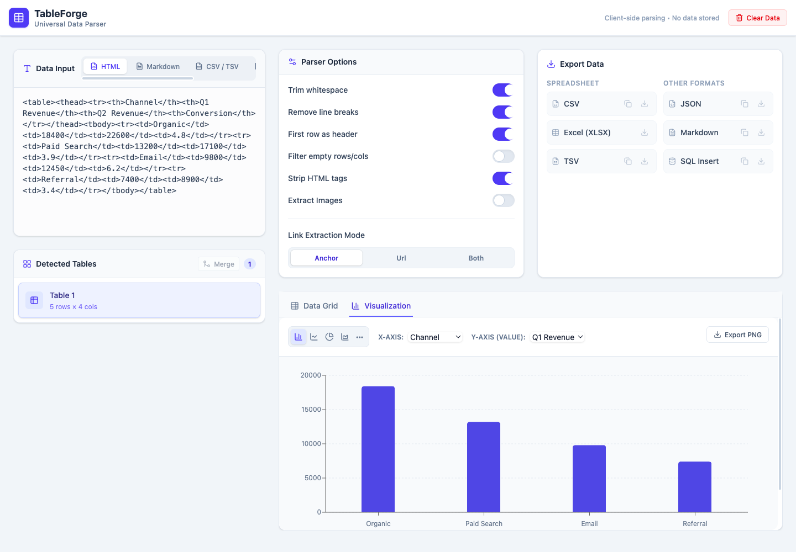

# TableForge

[Live demo](https://remixmb.github.io/tables-tables-tables/) · [Quality checks](https://github.com/remixmb/tables-tables-tables/actions/workflows/ci.yml)

TableForge is a private-by-default browser workspace for messy tabular data. Paste HTML, Markdown, CSV, TSV, or JSON; inspect and edit the result; then export it as CSV, TSV, JSON, Markdown, SQL, XLSX, or an image. Input stays in the browser—there is no application server or analytics layer.



## Why this project

Moving a table between a webpage, a spreadsheet, a database, and documentation is usually a trail of one-off scripts. TableForge puts that cleanup loop in one inspectable interface and keeps sensitive source data client-side.

## Engineering highlights

- Four independently tested parsers normalize HTML, Markdown, CSV/TSV, and JSON into one typed table model.
- The HTML parser handles `rowspan`, `colspan`, nested markup, links, images, hidden elements, and configurable cleanup.
- The editable grid supports virtualized rendering, transpose, regex replacement, table joins, and inferred column types.
- Exports escape SQL strings and Markdown delimiters and generate real `.xlsx` workbooks in the browser.
- Charts are derived from compatible numeric columns; source data never leaves the page.
- Visualization and XLSX code load only when requested, keeping the initial workspace bundle focused on parsing and editing.

## Quality

```bash
npm ci
npm run check
```

`check` runs ESLint, the Vitest parser/export suite, TypeScript compilation, and the production Vite build. GitHub Actions runs the same gate on pushes and pull requests.

## Local development

```bash
npm ci
npm run dev
```

The production build uses a relative asset base so it can run on GitHub Pages:

```bash
npm run build
npm run preview
```

## Architecture

```text
src/parser/    format-specific normalization and tests
src/hooks/     browser session and derived selection state
src/components editable grid, merge, export, and visualization UI
src/exporter/  serialized and downloadable output formats
```

The application is intentionally client-only. That trades collaborative storage and server-side processing for a smaller privacy boundary and a deployable static artifact.

## License

MIT — see [LICENSE](LICENSE).
